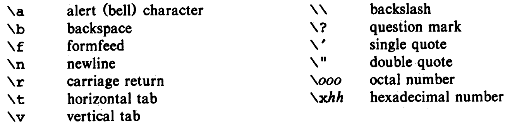
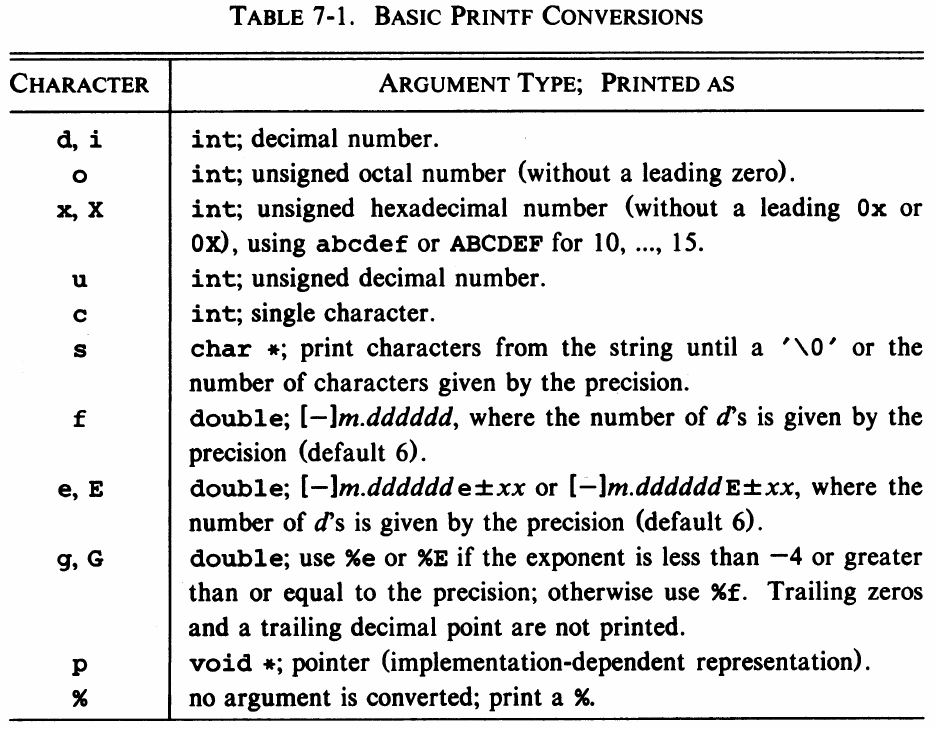

# Конспект 7 сентября 2021

На этом занятии уточним и закрепим основы языка Си, которые мы обсуждали в прошлый раз.

## Операторы в Си

### Арифметические операторы

В порядке уменьшения приоритета:

1. Операторы инкремента и декремента `++` и `--`
2. Унарный минус `-`
3. Умножение, деление, остаток от деления: `*`, `\`, `%`
4. Сложение и вычитание `+`, `-`

### Операторы сравнения

В порядке уменьшения приоритета:

1. Операторы отношения: `>`, `<`, `>=`, `<=`
2. Операторы равенства: `==`, `!=`

Арифметические операторы имеют более высокий приоритет, чем операторы сравнения.

### Логические операторы

В порядке уменьшения приоритета:

1. Логическое *не* `!`
2. Логическое *и* `&&`
3. Логическое *или* `||`

### Резюме

Суммируем операторовы в порядке уменьшения приоритета:

1. Постфиксные `++` и `--`
2. Префиксные `++` и `--`, `!`
3. `*`, `\`, `%`
4. `+`, `-`
5. `&&`
6. `||`

Это не все операторы языка Си. Например, операторы вызова функции `()` и индексации `[]` имеют самый высокий приоритет (такой же как постфиксные `++` и `--`). Побитовые операторы обсудим позже.

## Форматированный ввод и вывод

### Краткий справочник

Набор специальных символов (escape-последовательностей):



Набор символов преобразования для функции `printf`:

)

### Тонкая настройка вывода

**Пример 1.** Вывод целого числа с минимальной шириной `6`. Целые числа будут выровнены по правому краю. Числа, которые занимают больше, чем шесть символов, будут выведены полностью:

```c
printf("%6d", num);
```

**Пример 2.** Вывод числа с плавающей точкой минимальной шириной `10` и с тремя знаками после запятой:

```c
printf("%10.3f", var);
```

**Пример 3.** Вывод строки с минимальной шириной `10`:

```c
printf("%10s", line);
```

**Пример 4.** Вывод строки `line` с максимальной длиной, заданной параметром `max`:

```c
printf("%.*s", max, line);
```

*Упражнение 1*. Написать программу для перевода радиан в градусы, вывести красиво отформатированную таблицу перевода для нескольких значений. Используйте константу `M_PI` из библиотеки `<math.h>`

*Упражнение 2*. Например программу для поиска расстояния между двумя точками на плоскости. Координаты точек вводить с клавиатуры.

## Уловный оператор

Пример 1. Оператор `if`

```c
if (a == 1) {
    // do something
}
```

Пример 2. Комбинация `if` - `else`

```c
if (a == 1) {
    // do something
} else {
    // do something else
}
```

Пример 3. Комбинация `else if`

```c
if (a == 1) {
    // do something
} else if (a == 2) {
    // do something else
} else {
    // do something really interesting
}
```

*Упражнение 3*. Написать программу для решения линейного уравнения. Коэффициенты вводить с клавиатуры. Обрабатывать все возможные значения.

*Упражнение 4*. Написать программу для решения квадратного уравнения. Коэффициенты вводить с клавиатуры. Обрабатывать все возможные значения.

## Цикл `for`

Пример 1. Квадраты натуральных чисел.

```c
for (int i = 0; i < 10; ++i) {
    printf("%3d %6d\n", i, i * i);
}
```

*Упражнение 5*. Написать программу для вывода первых `n` чисел Фибоначчи.

*Упражнение 6*. Написать программу для проверки простоты нарурального числа. Число вводится с клавиатуры.
