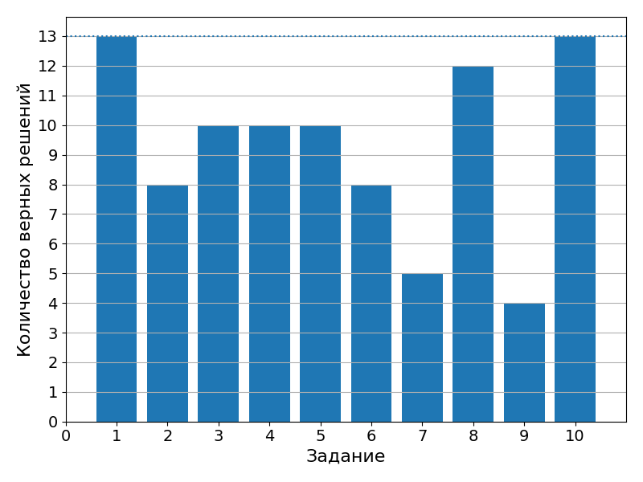

# 14 сентября 2021

Самостоятельная работа (10 вопросов). Результаты:

**Упражнение 1**. Написать программу для решения линейного уравнения. Коэффициенты вводить с клавиатуры. Обрабатывать все возможные значения.

**Упражнение 2**. Написать программу для решения квадратного уравнения. Коэффициенты вводить с клавиатуры. Обрабатывать все возможные значения.
