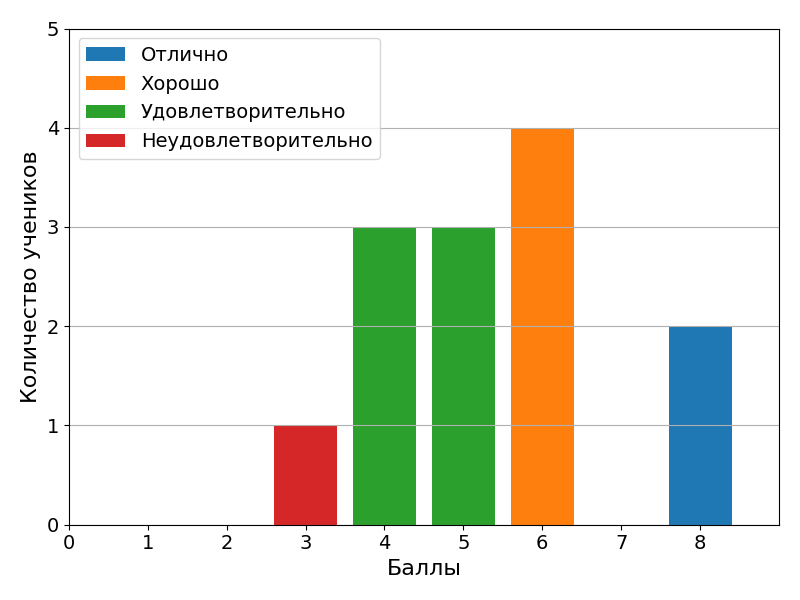
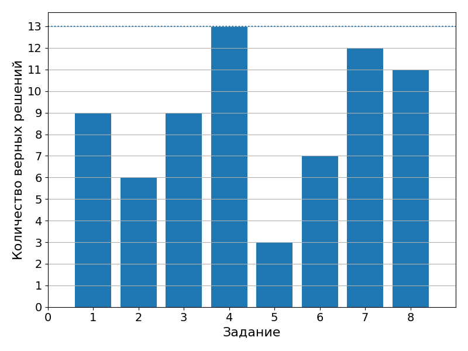

# 28 сентября 2021

Самостоятельная работа (8 вопросов). Результаты:

**Упражнение 1**. Написать функцию для сортировки массива [методом слияния](https://ru.wikipedia.org/wiki/%D0%A1%D0%BE%D1%80%D1%82%D0%B8%D1%80%D0%BE%D0%B2%D0%BA%D0%B0_%D1%81%D0%BB%D0%B8%D1%8F%D0%BD%D0%B8%D0%B5%D0%BC).

**Упражнение 2**. Написать функицю для поиска подстроки в строке. Функция принимает строку (`char[]`), размер строки (`size_t`), подстроку (`char[]`), размер подстроки (`size_t`) и возвращает индекс первого символа в строке, с которого начинается подстрока. Если подстрока не найдена, возвращается `-1`. Эту задачу можно решать по-разному. Придумайте алгоритм решения задачи и обсудите его с преподавателем до того как начнете писать код.
