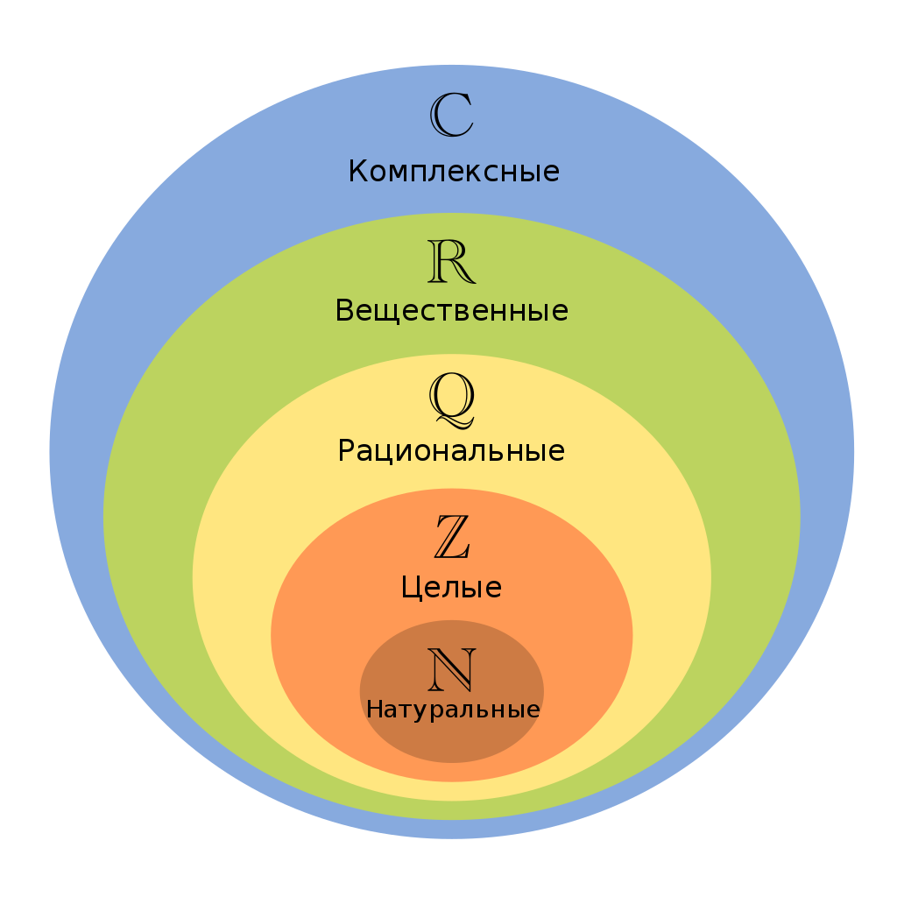

# 5 октября 2021

## Число

**Число** - одно из основных понятий математики, используемое для количественной характеристики, сравнения, нумерации объектов и их частей.

Традиционно выделяют следующие множества чисел, каждое из которых включает все предыдущие:

 - **Натуральные числа** &#8469; = {1, 2, 3, ...}
 - **Целые числа** &#8484; = {..., -2, -1, 0, 1, 2, ...}
 - **Рациональные числа** &#8474; - числа, представимые в виде дроби, числитель которой является целым числом, а знаменатель - натуральным
 - **Действительные числа** &#8477;. Множеству дейситвительных чисел можно поставить в соответствие множество всех точек на прямой. Действительные числа включают рациональные и иррациональные числа. Последние нельзя представить в виде дроби (например, число пи).
 - **Комплексные числа** &#8450;. Множеству комплексных числел можно поставить в соответствие множество всех точек на плоскости.



## Позиционные системы счисления

**Система счисления** - символический метод записи чисел, представление чисел с помощью письменных знаков.

Классификация систем счисления:

- Непозиционные
- Позиционные

Пример непозиционной системы счисления - римские цифры:

|  1  |  5  | 10  | 50  | 100 | 500 | 1000|
| --- | --- | --- | --- | --- | --- | --- |
|  I  |  V  |  X  |  L  |  C  |  D  |  M  |

В непозиционных системах значение символа (*цифры*) не зависит от положения в записи числа.

В позиционных системах счисления значение цифры зависит от ее позиции (разряда).

**Цифра** - сивол для записи чисел.

**Разряд** - индекс цифры в обозначении числа.

**Основание системы** - количество единиц одного разряда, составляющее единицу соседнего, более старшего разряда.

Привычная нам система счиаления - позиционная с основанием `10` (десятичная). В качестве символов мы используем арабские цифры: `0, 1, 2, 3, 4, 5, 6, 7, 8, 9`.

Для подсчета секунд, минут и часов мы используем шестидесятиричную систему. Для подсчета количества дней и недель мы используем семиричную систему. Информация в компьютере всегда хранится в двоичной системе.

## Перевод чисел из одной системы в другую

Алгоритм перевода записи числа `A` из десятичной системы счисления в систему с основанием `r`:

1. Определяем переменную `B`, присваеваем ей значение `A`
2. Находим остаток от деления `B` на `r` - это очередная искамая цифра
3. Присваиваем переменной `B` значение от целочисленного деления `B` на `r`. Если `B` не равно нулю, возвращаемся на шаг `2`
4. Выписываем полученные цифры в обратном порядке

**Пример 1**. Переведем число `34` в семиричную систему.

```bash
B = 34
34 % 7 = 6  (цифра младшего разряда)
B = B / 7 = 4
4 % 7 = 4   (цифра следущего разряда)
B = B / 7 = 0
```

Получаем, что число `34` записывается в семиричной системе как `46`.

Перевод записи числа `A` из системы с основанием `r` в десятичную выполняется следющим образом. Пусть `A` представлено следующими символами:

```bash
a[1] a[2] a[3] ... a[n]
```

Тогда, выполняя следующие операции в десятичной системе, получим нужный резулдьтат:

```bash
A = a[n] + a[n-1] * r + a[n-2] * r^2 + ... + a[1] * r^{n-1}
```
