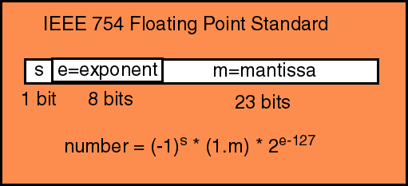

# 7 октября 2021

## Представление чисел в компьютере

Двоичная система счисления особенно важна в программировании. Любая информация в компьютере хранится в виде последовательности битов. Каждый бит может быть равен нулю либо единице. Процессор выполняет различные операции с двоичными числами.

### Дополнительный код

Представление беззнаковых целых чисел в памяти не вызывает вопросов. Для представления знаковых целых чисел чаще всего используется *дополнительный код* (two's complement).

| Десятичное представление | Прямой |  Обратный |  Дополнительный  |
| --- | --- | --- | --- |
| 127     |  0111 1111 | 0111 1111 |  0111 1111
| 1       |  0000 0001 | 0000 0001 |  0000 0001
| 0       |  0000 0000 | 0000 0000 |  0000 0000
| -0      |  1000 0000 | 1111 1111 |  0000 0000
| -1      |  1000 0001 | 1111 1110 |  1111 1111
| -2      |  1000 0010 | 1111 1101 |  1111 1110
| -3      |  1000 0011 | 1111 1100 |  1111 1101
| -4      |  1000 0100 | 1111 1011 |  1111 1100
| -5      |  1000 0101 | 1111 1010 |  1111 1011
| -6      |  1000 0110 | 1111 1001 |  1111 1010
| -7      |  1000 0111 | 1111 1000 |  1111 1001
| -8      |  1000 1000 | 1111 0111 |  1111 1000
| -9      |  1000 1001 | 1111 0110 |  1111 0111
| -10     |  1000 1010 | 1111 0101 |  1111 0110
| -11     |  1000 1011 | 1111 0100 |  1111 0101
| -127    |  1111 1111 | 1000 0000 |  1000 0001
| -128    |  ---       |  ---      |  1000 0000

Дополнительный код для отрицательного числа можно получить инвертированием его двоичного модуля и прибавлением к инверсии единицы, либо вычитанием числа из нуля.

Дополнительный код двоичного числа определяется как величина, полученная вычитанием числа из наибольшей степени двойки. 

Дополнительный код позволяет сделать операции сложения и вычитания одинаковыми для знаковых и беззнаковых чисел.

### Стандарт IEEE-754

Числа одинарной точности с плавающей точкой описывают, используя [стандарт IEEE-754](https://ru.wikipedia.org/wiki/%D0%A7%D0%B8%D1%81%D0%BB%D0%BE_%D0%BE%D0%B4%D0%B8%D0%BD%D0%B0%D1%80%D0%BD%D0%BE%D0%B9_%D1%82%D0%BE%D1%87%D0%BD%D0%BE%D1%81%D1%82%D0%B8).

Следующая схема ([источник](http://www.c-jump.com/bcc/common/Talk2/Cxx/IEEE_754_fp_standard/IEEE_754_fp_standard.html)) показывает способ представления переменной `float` в языке Си:



```c
float a = -1.045e-12;  // - 1.045 x 10^{-12}
```

В `32` битовом числе один бит хранит знак, `8` битов хранят (смещенный на `127`) показатель экспоненты, оставшиеся биты хранят *мантиссу* - значение числа без учета порядка.

На [этом сайте](https://www.h-schmidt.net/FloatConverter/IEEE754.html) есть интерактивная иллюстрация для представления чисел с плавающей точкой.

## Битовые операции в Си

### Побитовое И: `&`

Бинарый оператор:

|       | 0 | 1 |
|  ---  |---|---|
| **0** | 0 | 0 |
| **1** | 0 | 1 |

```c
int a = 5;      // 101 
int b = 3;      // 011
int c = a & b;  // 001
```

### Побитовое ИЛИ: `|`

Бинарый оператор:

|       | 0 | 1 |
|  ---  |---|---|
| **0** | 0 | 1 |
| **1** | 1 | 1 |

```c
int a = 5;      // 101 
int b = 3;      // 011
int c = a | b;  // 111
```

### Побитовое исключающее ИЛИ (XOR): `^`

Бинарый оператор:

|       | 0 | 1 |
|  ---  |---|---|
| **0** | 0 | 1 |
| **1** | 1 | 0 |

```c
int a = 5;      // 101 
int b = 3;      // 011
int c = a ^ b;  // 110
```

### Побитовое НЕ: `~`

Унарный оператор:

| 0 | 1 |
|---|---|
| 1 | 0 |

```c
int a = 5;   // 101 
int c = ~b;  // 010
```

### Битовые сдвиги

Унарные операторы `<<` и `>>`:

```c
int a = 20;      // 0010100 
int b = a << 2;  // 1010000
int b = a >> 2;  // 0000101
```

Сдвиг влево на `1` эквивалентен умножению на `2`, сдвиг вправо - делению на `2`.


## Примеры

Битовые операторы позволяют очень гибко манипулировать значениями переменных.

**Пример 1**. Манипуляции с одним битом:
1. Установка `n`-го бита в значение `1`:
   ```c
   x | (1 << n);
   ```
2. Установка `n`-го бита в значение `0`:
   ```c
   x & ~(1 << n);
   ```
3. Переключение значения `n`-го бита:
   ```c
   x ^ (1 << n);
   ```

**Пример 2**. Красивый метод подсчета количества единиц в двоичной записи числа:

```c
size_t bitcount(unsigned int n) {
    size_t count = 0;
    while (n) {
        ++count;
        n = n & (n - 1);
    }
    return count;
}
```

Проверьте, что эта программа верна. Подумайте почему она работает.

**Пример 3**. Другой интересный пример - обмен значений двух переменных с использованием операции `XOR`:

```c
void xor_swap(int* a, int* b) {
    *a = *a ^ *b;
    *b = *b ^ *a;
    *a = *a ^ *b;
}
```

Схема иллюстрирует работу алгоритма:


## Свойста битовых операций

Для каждого из рассмотренных битовых операторов выполняются следующие соотношения (на примере оператора И):

1. Коммутативность
    ```c
    a & b == b & a;
    ```
2. Ассоциативность
    ```c
    (a & b) & c == a & (b & c);
    ```
3. Существование единицы. Для любого `a` типа `int` следующие выражения истинны:
    ```c
    a & ~(1 << 31) == a;  // предполагая, что int имеет размер 4 байта
    a | 0 == a;
    a ^ 0 == a;
    ```

Выражение `~(1 << 31)` можзволяет получить максимальное знечение переменной типа `int`.

Заметим также, что:

```c
a & a == a;
a | a == 0;
a ^ a == 0;

a & ~a == 0;
a | ~a == ~(1 << 31);
a ^ ~a == ~(1 << 31);
```

**Упражнение 1**. Напишите функцию, принимающую переменную `unsigned int` и определяющую является ли это число степенью двойки.

**Упражнение 2**. Напишите функцию, принимающую переменную `unsigned int` и определяющую равен ли единице `i`-й бит его двоичного представления. Индекс `i` также является аргументом функции.

**Упражнение 3**. Напишите функцию для циклической перестановки битов числа (две функции: для левой и для правой перестановок).

**Упражнение 4**. Написать функцию, которая определяет знак переменной `int`, используя только битовые операторы.

**Упражнение 5**. Написать функцию, которая возвращает модуль переменной `int` и не использует оператор `if`.

**Упражнение 6**. Написать функцию, которая возвращает максимум из двух переменных типа `int` и не использует оператор `if`.

**Упражнение 7**. Написать функцию, которая проверяет имеют ли две переменные типа `int` одинаковый знак и использует только битовые операции.

**Упражнение 8**. Написать функцию, которая изменяет знак переменной типа `int` и использует только битовые операции.


**Упражнение 9**. Написать функцию, которая устанавливает в ноль все биты переменной типа `int`, кроме `k` младших битов. `k` младших битов не изменяются.

