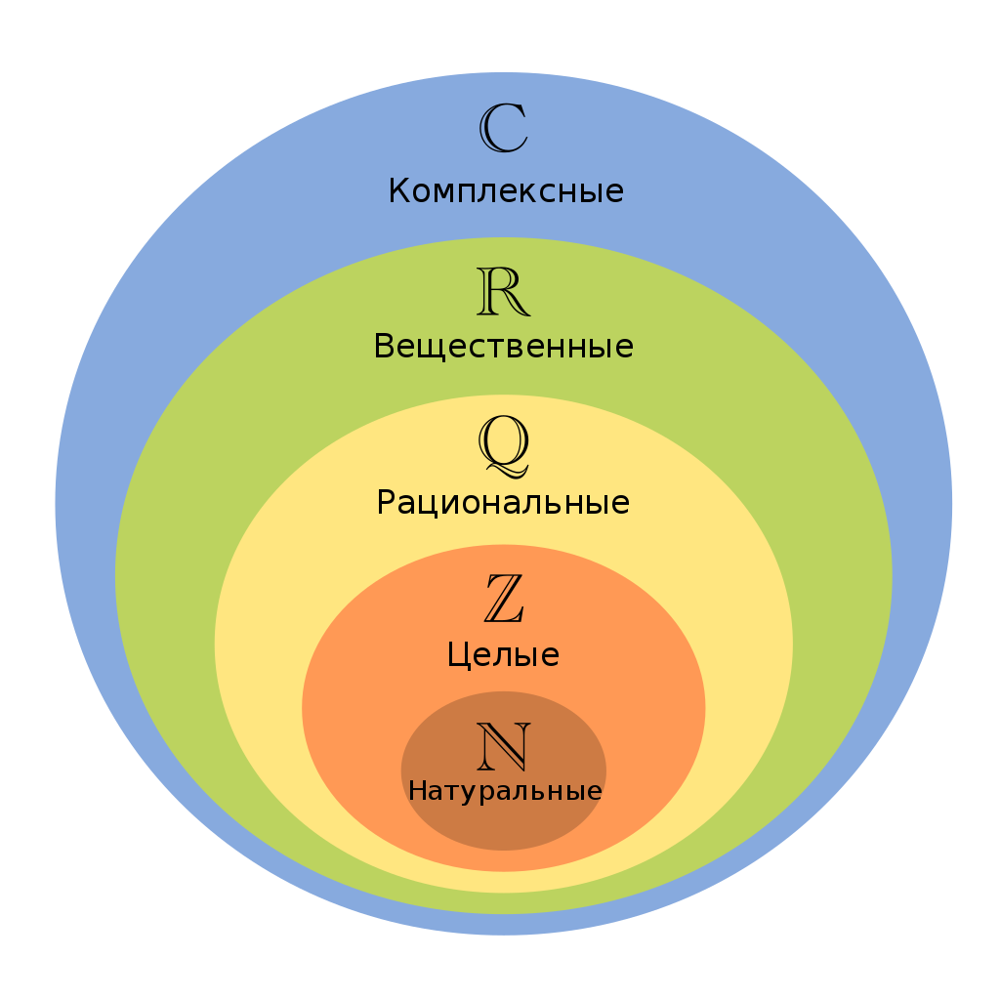

## Позиционные системы счисления

**Число** - одно из основных понятий математики, используемое для количественной характеристики, сравнения, нумерации объектов и их частей.

Традиционно выделяют следующие множества чисел, каждое из которых включает все предыдущие:

 - **Натуральные числа** &#8469; = {1, 2, 3, ...}
 - **Целые числа** &#8484; = {..., -2, -1, 0, 1, 2, ...}
 - **Рациональные числа** &#8474; - числа, представимые в виде дроби, числитель которой является целым числом, а знаменатель - натуральным
 - **Действительные числа** &#8477;. Множеству дейситвительных чисел можно поставить в соответствие множество всех точек на прямой. Действительные числа включают рациональные и иррациональные числа. Последние нельзя представить в виде дроби (например, число пи).
 - **Комплексные числа** &#8450;. Множеству комплексных числел можно поставить в соответствие множество всех точек на плоскости.



**Система счисления** - символический метод записи чисел, представление чисел с помощью письменных знаков.

Классификация систем счисления:

- Непозиционные
- Позиционные

Пример непозиционной системы счисления - римские цифры:

|  1  |  5  | 10  | 50  | 100 | 500 | 1000|
| --- | --- | --- | --- | --- | --- | --- |
|  I  |  V  |  X  |  L  |  C  |  D  |  M  |

В непозиционных системах значение символа (*цифры*) не зависит от положения в записи числа.

В позиционных системах счисления значение цифры зависит от ее позиции (разряда).

**Цифра** - сивол для записи чисел.

**Разряд** - индекс цифры в обозначении числа.

**Основание системы** - количество единиц одного разряда, составляющее единицу соседнего, более старшего разряда.

Привычная нам система счиаления - позиционная с основанием `10` (десятичная). В качестве символов мы используем арабские цифры: `0, 1, 2, 3, 4, 5, 6, 7, 8, 9`.

Для подсчета секунд, минут и часов мы используем шестидесятиричную систему. Для подсчета количества дней и недель мы используем семиричную систему. Информация в компьютере всегда хранится в двоичной системе.

## Перевод чисел из одной системы в другую

Алгоритм перевода записи числа `A` из десятичной системы счисления в систему с основанием `r`:

1. Определяем переменную `B`, присваеваем ей значение `A`
2. Находим остаток от деления `B` на `r` - это очередная искамая цифра
3. Присваиваем переменной `B` значение от целочисленного деления `B` на `r`. Если `B` не равно нулю, возвращаемся на шаг `2`
4. Выписываем полученные цифры в обратном порядке

**Пример 1**. Переведем число `34` в семиричную систему.

```bash
B = 34
34 % 7 = 6  (цифра младшего разряда)
B = B / 7 = 4
4 % 7 = 4   (цифра следущего разряда)
B = B / 7 = 0
```

Получаем, что число `34` записывается в семиричной системе как `46`.

Перевод записи числа `A` из системы с основанием `r` в десятичную выполняется следющим образом. Пусть `A` представлено следующими символами:

```bash
a[1] a[2] a[3] ... a[n]
```

Тогда, выполняя следующие операции в десятичной системе, получим нужный резулдьтат:

```bash
A = a[n] + a[n-1] * r + a[n-2] * r^2 + ... + a[1] * r^{n-1}
```

**Упражнение 1**. Напишите функицю для перевода числа из десятичной системы в систему счисления с основанием `q`. Число в `q`-системе представить в виде массива цифр.

**Упражнение 2**. Напишите функицю для перевода числа из системы счисления с основанием `q` в десятичную систему счисления. Число в `q`-системе представить в виде массива цифр.

## Представление чисел в компьютере

Двоичная система счисления особенно важна в программировании, т.к. вся информация в компьютере хранится в виде последовательности битов. Каждый бит может быть равен нулю либо единице. 

### Дополнительный код

Представление беззнаковых целых чисел в памяти не вызывает вопросов. Для представления знаковых целых чисел чаще всего используется *дополнительный код* (two's complement).

| Десятичное представление | Прямой |  Обратный |  Дополнительный  |
| --- | --- | --- | --- |
| 127     |  0111 1111 | 0111 1111 |  0111 1111
| 1       |  0000 0001 | 0000 0001 |  0000 0001
| 0       |  0000 0000 | 0000 0000 |  0000 0000
| -0      |  1000 0000 | 1111 1111 |  0000 0000
| -1      |  1000 0001 | 1111 1110 |  1111 1111
| -2      |  1000 0010 | 1111 1101 |  1111 1110
| -3      |  1000 0011 | 1111 1100 |  1111 1101
| -4      |  1000 0100 | 1111 1011 |  1111 1100
| -5      |  1000 0101 | 1111 1010 |  1111 1011
| -6      |  1000 0110 | 1111 1001 |  1111 1010
| -7      |  1000 0111 | 1111 1000 |  1111 1001
| -8      |  1000 1000 | 1111 0111 |  1111 1000
| -9      |  1000 1001 | 1111 0110 |  1111 0111
| -10     |  1000 1010 | 1111 0101 |  1111 0110
| -11     |  1000 1011 | 1111 0100 |  1111 0101
| -127    |  1111 1111 | 1000 0000 |  1000 0001
| -128    |  ---       |  ---      |  1000 0000

### Стандарт IEEE-754

Число одинарной точности с плавающей запятой. [Описание в Wikipedia](https://ru.wikipedia.org/wiki/%D0%A7%D0%B8%D1%81%D0%BB%D0%BE_%D0%BE%D0%B4%D0%B8%D0%BD%D0%B0%D1%80%D0%BD%D0%BE%D0%B9_%D1%82%D0%BE%D1%87%D0%BD%D0%BE%D1%81%D1%82%D0%B8).

```c
float a = -1.045e-12;  // - 1.045 x 10^{-12}
```

В `32` битовом числе один бит хранит знак, `8` битов хранят показатель экспоненты (порядок), оставшиеся биты хранят *мантиссу* - значение числа без учета порядка.

## Битовые операции в Си

### Побитовое И: `&`

Бинарый оператор:

|       | 0 | 1 |
|  ---  |---|---|
| **0** | 0 | 0 |
| **1** | 0 | 1 |

```c
int a = 5;      // 101 
int b = 3;      // 011
int c = a & b;  // 001
```

### Побитовое ИЛИ: `|`

Бинарый оператор:

|       | 0 | 1 |
|  ---  |---|---|
| **0** | 0 | 1 |
| **1** | 1 | 1 |

```c
int a = 5;      // 101 
int b = 3;      // 011
int c = a | b;  // 111
```

### Побитовое исключающее ИЛИ: `^`

Бинарый оператор:

|       | 0 | 1 |
|  ---  |---|---|
| **0** | 0 | 1 |
| **1** | 1 | 0 |

```c
int a = 5;      // 101 
int b = 3;      // 011
int c = a ^ b;  // 110
```

### Побитовое НЕ: `~`

Унарный оператор:

| 0 | 1 |
|---|---|
| 1 | 0 |

```c
int a = 5;   // 101 
int c = ~b;  // 010
```

### Битовые сдвиги

Унарные операторы `<<` и `>>`:

```c
int a = 20;      // 0010100 
int b = a << 2;  // 1010000
int b = a >> 2;  // 0000101
```

Сдвиг влево на `1` эквивалентен умножению на `2`, сдвиг вправо - делению на `2`.

**Пример**. Существует красивый метод подсчета коилчества единиц в двоичной записи числа:

```c
size_t bitcount(unsigned int n) {
    size_t count = 0;
    while (n) {
        ++count;
        n = n & (n - 1);
    }
    return count;
}
```

Проверьте, что эта программа верна. Подумайте почему она работает.

**Упражнение**. Напишите функцию, принимающую переменную `unsigned int` и определяющую является ли это число степенью двойки.

**Упражнение**. Напишите функцию, принимающую переменную `unsigned int` и определяющую равен ли единице `i`-й бит его двоичного представления. Индекс `i` также является аргументом функции.

**Упражнение**. Напишите функцию для циклической перестановки битов числа (две функции: для левой и для правой перестановок).
