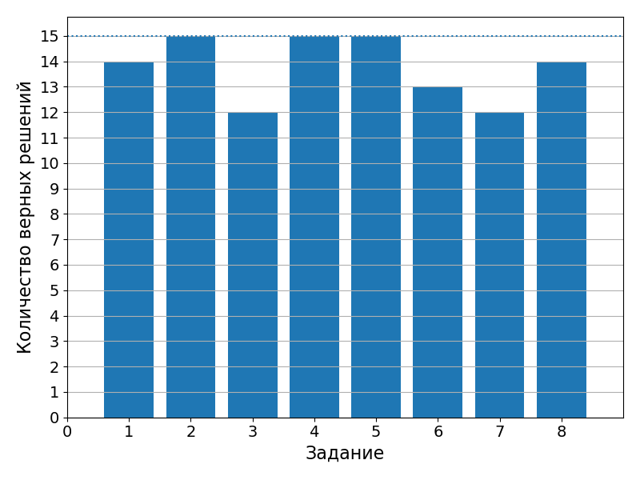

# 19 октября 2021

Самостоятельная работа на тему "Позиционные системы счисления". Результаты




## Измерение времени

При написании программ бывает полезно измерять время работы отдельных частей кода. Инструменты для измерения есть в стандартной библиотеке `time.h`:

```c
#include <time.h>

clock_t start = clock();
// Do something
clock_t end = clock();
float seconds = (float)(end - start) / CLOCKS_PER_SEC;
```

## Псевдослучайные числа

Функция `rand` из стандартной библиотеки `stdlib.h` позволяет генерировать псевдостучайные целые числа от `0` до `RAND_MAX`. Функция `srand` позволяет выбрать последовательность псевдостучайных чисел. Для данного агрумента `srand` функция `rand` будет выдавать одну и ту же последовательность:

```c
#include <stdlib.h>

srand(10);
int r = rand();
```

**Упражение 3**. Заполните массив из `100000` значений случайными числами и измерьте время сортировки этого массива с помощью алгоритма сортировки вставками.

## Работа с файлами

### Чтение данных из файла

Функция `fopen` из библиотеки `stdio.h` позволяет открыть файл. Пусть у нас есть файл `data.txt` следующего содержания:

```bash
6
5
8
5
3
1
4
```

Прочитаем первое число из этого файла:

```c
FILE* fptr = fopen("data.txt", "r");
if (fptr == NULL) {
    puts("Can't open file");
    return 1;
}

int n;
fscanf(fptr, "%d", &n);
printf("%d\n", n);
```

Первый аргумент функции `fopen` - путь до файла, второй аргумент может принимать значения:

- `"r"` - открытие файла для чтения
- `"w"` - открытие файла для записи (если файл существует, он будет переписан)
- `"a"` - открытие файла для записи в конец существующего файла (append)

Если добавить символ `b`, то работа с файлом будет происходить в бинарном (а не в текстовом) режиме (например, `"rb"` означает чтение бинарных данных).

Функция `fopen` возвращает указатель на структуру `FILE`. Эта структура содержит всю необходимую информацию для дальнейшей работы с файлом. Если файл не удалось открыть, то `fopen` возвращает `NULL`. Всегда проверяйте открылся успешно ли открылся файл.

Функция `fscanf` является аналогом функции `scanf` для работы с файлами. Единственное отличие состоит в том, что первым аргументом необходимо передать указатель `FILE*`.

Другие функции для чтения символов из файла:

- `fgetc` читает один символ:

  ```c
  FILE* fptr = fopen("data.txt", "r");
  char ch = fgetc(fptr);
  ```

  `fgetc` возвращает константу `EOF` в случае, если достигнут конец файла.
- `getline` читает файл до символа переноса строки, до конца файла или до достижения ограничения по размеру (задается вторым аргументом):

  ```c
  FILE* fptr = fopen("data.txt", "r");
  char s[100];
  getline(s, 100, fptr);
  ```

После завершения работы с файлом, его необходимо закрыть. Для этого необходимо вызвать функцию `fclose`.

Функция `feof` позволяет узнать достигнут ли конец файла. Используя эту функцию, прочитаем файл `data.txt` полностью. Вот полный код программы:

```c
#include <stdio.h>

int main() {
    FILE* fptr = fopen("data.txt", "r");
    if (fptr == NULL) {
        puts("Can't open file");
        return 1;
    }

    int n;
    while (!feof(fptr)) {
        fscanf(fptr, "%d", &n);
        printf("%d ", n);
    }
    putchar('\n');
    fclose(fptr);

    return 0;
}
```

В результате выполнения программы получим:

```bash
6 5 8 5 3 1 4 4 
```

### Запись данных в файл

Для записи данных в файл существуют функции, аналогичные функциям вывода в стандарный поток:

- `fprintf` отличается от `printf` тем, что первым аргументом принимает указатель `FILE*`.
- `fputc` записывает символ в файл.

Сгенерируем последовательность случайных чисел от `0` до `1` и запишем их в файл:

```c
#include <stdio.h>
#include <stdlib.h>

int main() {
    FILE* fptr = fopen("random.txt", "w");
    if (fptr == NULL) {
        puts("Can't create file\n");
        return 1;
    }

    for (int i = 0; i < 1000; ++i) {
        double x = (double)rand() / RAND_MAX;
        fprintf(fptr, "%.3lf\n", x);
    }

    fclose(fptr);

    return 0;
}
```
