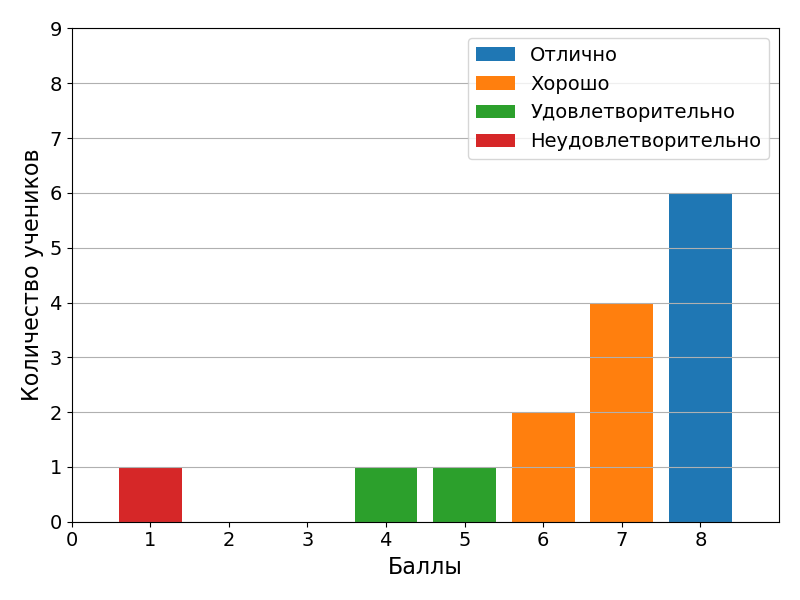

# 26 октября 2021

Самостоятельная работа на тему "Битовые операции". Результаты




## Структуры данных

Довольно часто несколько переменных в программе тесно связаны по смыслу. Например, координаты `x` и `y` точки на плоскости. **Структуры** в языке Си позволяют выразить мысль о связи переменных в явном виде:

```c
struct {
    double x;
    double y;
} point;

point.x = 0.2;
point.y = 0.4;


printf("Point(%.3lf, %.3lf)\n", point.x, point.y);
```

Получеаем:

```bash
> Point(0.200, 0.400)
```

Если какая-то структура используется в программе несколько раз, то разумно определить для нее псевдоним с помощью ключевого слова `typedef`:

```c
typedef struct {
    double x;
    double y;
} Point;

int main() {
    Point point;

    point.x = 0.2;
    point.y = 0.4;


    printf("Point(%.3lf, %.3lf)\n", point.x, point.y);

    return 0;
}
```

И получаем тот же результат.
