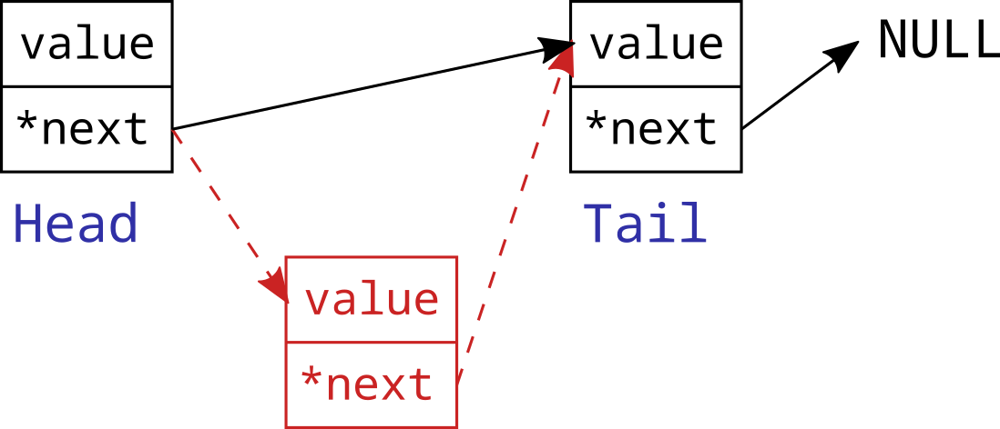
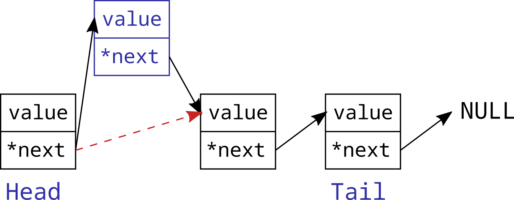

# 23 ноября 2021

## Связный список

Динамический массив (стек) позволяет эффективно добавлять и удалять последний элемент. Если задача требует большого количества вставок и удаления элементов в середине контейнера, то более эффективной структурой данных может оказаться *связный список*. Рассмотрим устройство *односвязного списка*. В этом контейнере каждый элемент является стурктурой данных с двумя полями: значение и ссылка на следующий элемент. Определим такую структуру:

```c
struct ListNode {
    int value;
    struct ListNode *next;
};
typedef struct ListNode ListNode;
```

Цепочка из таких структур и является связным списком:


Поле `next` последнего элемента списка имеет значение `NULL`.

Первый элемент списка называют *головой* (head), а последний - *хвостом* (tail). Удобно иметь быстрый доступ к голове и хвосту списка, поэтому определим еще одну структуру:

```c
typedef struct {
    size_t size;
    ListNode* head;
    ListNode* tail;
} List;
```

Поле `size` содержит информацию о количестве элементов в списке. Инициализировать пустой список будем с помощью функции:

```c
List init_list() {
    List l = {0, NULL, NULL};
    return l;
}
```

Удаление элемента из списка выполняется посредством изменения ссылок:



Удаление головы и хвоста списка следует обрабатывать специальным образом. Аналогично выполняется вставка нового элемента:



Заметим, что количество операций, которое необходимо выполняить для удаления или вставки элемента, не зависит от количества элементов в списке. Именно в этом состоит главное преимущество связного списка. За это преимущество мы заплатили большим объемом памяти, отсутствием возможности обращаться к элементам списка по индексу и более медленным перебором всех элементов списка.

*Двусвязный список* отличается тем, что каждый его элемент имеет ссылку не только на следующий элемент, но и на предыдущий. 

Реализуем следующие функции:

```c
// Создание элемента списка
ListNode* init_listnode(int value, ListNode* next) {
    ListNode* newnode = malloc(sizeof(ListNode));
    newnode->value = value;
    newnode->next = next;
    return newnode;
}
```

```c
// Вставка элемента после данного
void listnode_insert_next(ListNode* node, int value) {
    ListNode* current_next = node->next;
    ListNode* newnode = init_listnode(value, current_next);
    node->next = newnode;
}
```

```c
// Удаление элемента, следующего за данным
void listnode_remove_next(ListNode* node) {
    if (node == NULL || node->next == NULL) return;
    ListNode* current_next = node->next;
    node->next = node->next->next;
    free(current_next);
}
```

```c
// Вывод в консоль всех значений элементов, начинася с данного
void listnode_print(ListNode* node) {
    while (node != NULL) {
        printf("%d%s", node->value, node->next == NULL ? "\n" : " -> ");
        node = node->next;
    }
}
```

```c
// Вставка элемента в начало списка
void list_push_front(LinkedList* l, int value) {
    ListNode* new_head = init_listnode(value, l->head);
    l->head = new_head;
    if (!l->size) l->tail = new_head;
    ++l->size;
}
```

```c
// Вставка элемента в конец списка
void list_push_back(List* l, int value) {
    // Реализуйте эту функцию самостоятельно
}
```

```c
// Вывод всех значений списка в стандартный поток вывода
void list_print(LinkedList* l) {
    if (l == NULL) return;
    listnode_print(l->head);
}
```

```c
// Удаление первого элемента и возвращение его значения
int list_pop_front(LinkedList* l) {
    if (l == NULL || !l->size) return 0;
    ListNode* current_head = l->head;
    int value = current_head == NULL ? 0 : current_head->value;
    l->head = l->head->next;
    free(current_head);
    if (!--l->size) l->tail = NULL;
    return value;
}
```

```c
// Поиск первого элемента списка с данным значением.
// Функция возвращает указатель на найденный элемент.
// Функция возвращает NULL, если элемент не найден
ListNode* list_find(LinkedList* l, int value) {
    if (l == NULL) return NULL;
    ListNode* node = l->head;
    while (node != NULL) {
        if (node->value == value) return node;
        node = node->next;
    }
    return NULL;
}
```

```c
// Обмен местами двух элементов списка
void list_swap(ListNode* node1, ListNode* node2) {
    // Реализуйте эту функцию самостоятельно
}
```

Обратите внимание, что удаление последнего элемента в нашей текущей реализации односвязанного списка выполнить эффективно не удается.

**Упражнение 1**. Найти первые `10000` чисел, составленные только из нулей и девяток, и вывести их в порядке возрастания.
