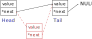
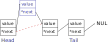

# 23 ноября 2021

## Связный список

Динамический массив (стек) позволяет эффективно добавлять и удалять последний элемент. Если задача требует большого количества вставок и удаления элементов в середине контейнера, то более эффективной структурой данных может оказаться *связный список*. Рассмотрим устройство *односвязного списка*. В этом контейнере каждое значение является стурктурой данных с двумя полями: значение и ссылка на следующий элемент. Определим такую структуру:

```c
typedef struct {
    int value;
    struct ListNode* next;
} ListNode;
```

Цепочка из таких структур и является связным списком:


Поле `next` последнего элемента списка имеет значение `NULL`.

Первый элемент списка называют *головой* (head), а последний - *хвостом* (tail). Удобно иметь быстрый доступ к голове и хвосту списка, поэтому определим еще одну структуру:

```c
typedef struct {
    size_t size;
    ListNode* head;
    ListNode* tail;
} List;
```

Поле `size` содержит информацию о количестве элементов в списке. Инициализировать пустой список будем с помощью функции:

```c
List init_list() {
    List l = {0, NULL, NULL};
    return l;
}
```

Удаление элемента из списка выполняется посредством изменения ссылок:



Удаление головы и хвоста списка следует обрабатывать специальным образом. Аналогично выполняется вставка нового элемента:



Заметим, что количество операций, которое необходимо выполняить для удаления или вставки элемента, не зависит от количества элементов в списке. Именно в этом состоит главное преимущество связного списка. За это преимущество мы заплатили большим объемом памяти, отсутствием возможности обращаться к элементам списка по индексу и более медленным перебором всех элементов списка.

*Двусвязный список* отличается тем, что каждый его элемент имеет ссылку не только на следующий элемент, но и на предыдущий. 

Реализуем следующие функции:

```c
// Вставка элемента, следующего за данным
void insert_after(ListNode* node, int value);
```

```c
// Удаление элемента, следующего за данным
void remove_after(ListNode* node);
```

```c
// Вставка элемента в начало списка
void list_push_front(List* l, int value);
```

```c
// Вставка элемента в конец списка
void list_push_back(List* l, int value);
```

```c
// Вывод всех значений списка в стандартный поток вывода
void list_print(List* l);
```

```c
// Поиск первого элемента списка с данным значением.
// Функция возвращает указатель на найденный элемент.
// Функция возвращает NULL, если элемент не найден
ListNode* list_find(List* l, int value);
```

```c
// Обмен местами двух элементов списка
void list_swap(ListNode* node1, ListNode* node2);
```

**Упражнение 1**. Найти первые `10000` чисел, составленные только из нулей и девяток, и вывести их в порядке позрастания.
