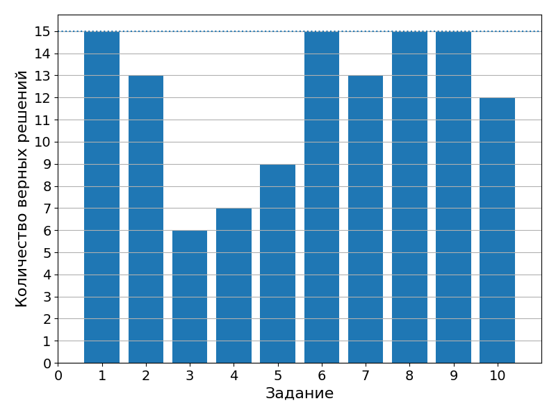

# 9 декабря 2021

Подведение итогов четверти и семестра, прием [обязательных заданий](../../monthly-assignment/2021-12.md). Три [обязательные задачи](../). За каждую ставится оценка.

|    ID    | 1 | 2 | 3 | Sum |
|   ---    |---|---|---| --- |
| **2134** | - | - | - |  2  |
| **1579** | 5 | 5 | - |  4  |
| **8890** | - | - | - |  2  |
| **2842** | - | - | - |  2  |
| **2841** | 5 | 5 | 5 |  5  |
| **1049** | 5 | 5 | 5 |  5  |
| **0934** | 5 | 5 | 5 |  5  |
| **1009** | - | - | - |  2  |
| **1230** | 5 | 4 | - |  4  |
| **5256** | - | 5 | 5 |  4  |
| **7106** | - | - | - |  2  |
| **3730** | 5 | 5 | 5 |  5  |
| **4107** | - | - | - |  2  |
| **1192** | - | - | - |  2  |
| **1206** | - | - | - |  2  |

Самостоятельная работа:

