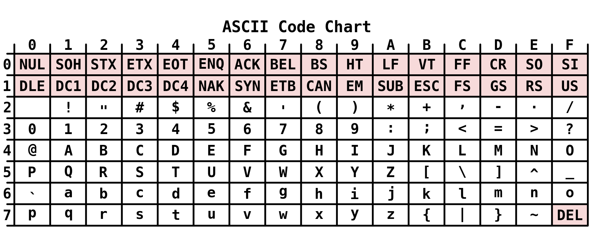

# dd mm 2021

## Кодирование текстовых данных

В памяти компьютера хранятся только биты информации - последовательность из нулей и единиц. Последовательность бит естественным образом можно использовать для хранения чисел (в двоичном представлении). Но как хранить тексты, которые представлены последовательностью *символов*? Решение состоит в том, чтобы каждый символ представить *кодом* - последовательностью битов.

### Кодировка ASCII

American standard code for information interchange (ASCII) - таблица кодировки симполов, разработанная в 1963 году. ASCII кодирует каждый симпол с помощью семи бит и включает:

* десятичные цифры
* латинский алфавит
* знаки препинания
* управляющие символы

Таблица ASCII показана ниже. Здесь строка показывает значение трех старших битов, а столбцы - четырех младших.



Язык Си [использует кодировку ASCII](https://en.cppreference.com/w/cpp/language/ascii) для кодирования символов (`char` занимает 8 бит, старший бит не участвует в кодировании).

Кодировка ASCII удобна тем, что буквы латинского алфавита распологаются последовательно: прописные быквы от `A` до `Z` представлены в диапазоне от `41` до `5a` (шестандцатеричная система), а строчные буквы от `a` до `z` - в диапазоне от `61` до `7a`.

ASCII - довольно ограниченная система кодирования символов и не отвечает современным требованиям передачи данных в сети. В настоящее время стандарт [Unicode](https://ru.wikipedia.org/wiki/%D0%AE%D0%BD%D0%B8%D0%BA%D0%BE%D0%B4) используется гораздо шире. Этот стандарт позволяет кодировать знаки почти всех письменных языков мира. Строки в языке Python закодированы с помощью Unicode. За такую универсальностью приходится платить памятью - размер символа в Unicode лежит в диапазоне от одного до четырех байт.

## Префиксный код

Таблица ASCII кодирует каждый символ одинаковым количеством битов. Это позволяет легко кодировать и декодировать данные. Давайте зададимся целью сделать код, занимающий наименьшее место в памяти. 

Ни одно из кодовых значений не является префиксом другого кодового значения. В этом случае гарантируется однозначное декодирование данных.

### Префиксное дерево

Префиксный код можно представить в виде дерева.

Задача: построить оптимальное префиксное дерево для данного распределения частоты использования символов.

### Код Хаффмана

Пусть алфавит содержит `n` символов, `n > 2`. Каждому символу `a_i` соответствует частота появления `f_i`, пусть `f_i != f_j` для любых `i != j`.

Определим для префиксного дерева `T` величину `v(T)`:

```c
v(T) = alpha_0 * f_0 + alpha_1 * f_1 + ... + alpha_{n-1} * f_{n-1}
```

Здесь `alpha_i` обозначает количество бит, которые используются для кодирования символа `a_i`.

Пусть `a_k` и `a_l` - два элемента с наименьшими частотами. Тогда для префиксного дерева Хаффмана выполняются условия:

1. Имеют наибольшую глубину
2. Имеют общего родителя


Построение префиксного дерева Хаффмана:

1. Находим два символа с наименьшими частотами и делаем из них узлы дерева с общим родителем.
2. Объединяем эти два элемента в новый элемент. Частота нового элемента равна сумме частот элементов.
3. Повторяем процедуру, начиная с шага 1 до тех пор пока не останется один элемент.

Код Хаффмана гарантирует оптимальность кодирования (т.е. наименьшее значение величины `v(T)` для данного набора символов и значений их частот).

**Пример**. Кодирование последовательности ДНК.


## Работа с динамической памятью

До сих пор в работе с памятью мы полагались на компилятор. Память, необходимая для переменных или массивов, выделается *автоматически*. При этом происходит работа с быстрой областью памяти - **стеком**.

Язык Си предоставляет инструменты для ручного управления памятью с помощью функуий `malloc`, `realloc`, `free` и некоторых других. Эти функции определенны в библиотеке `stdlib.h`.

Функция [`malloc`](https://en.cppreference.com/w/c/memory/malloc) принимает размер запрашиваемой памяти в байтах, выделает соответствующую память (непрерывный участок памяти), и возвращает указатель на начало выделенной области. Выделить память для массива из десяти элементов типа `int` можно следующим образом:

```c
int* dynamic_array = malloc(10 * sizeof(int));
```

Память, полученная таким образом, выделается в более медленной области памяти, которую называют *кучей* (heap). Размер кучи значительно превосходит размер стека, поэтому динамическое выделение памяти используется для хранения данных, которые не могут поместиться на стеке. Обычно размер стека не превосходит 10 МБ.

Ключевая особенность работы с динамической памятью (в отличие от работы с автоматической памятью) состоит в том, что программист должен следить за *освобождением* памяти. Как только выделенная память перестала быть нужной, необходимо вызвать функцию `free`:

```c
free(dynamic_array);
```

Такой способ работы с памятью позволяет управлять временем жизни объектов. Рассмотрим пример. Напишем фукнцию, которая создает массив и возвращает указатель на его начало. Реализация без динамической памяти работать не будет:

```c
// Эта функция не работает!
int* make_array_wrongly() {
    int array[100];
    for (int i = 0; i < 100; ++i) array[i] = i;
    return array;
}
```

Автоматический массив `array` удалается со стека как только функция `make_array` закончила работу. В результате мы вернем указатель на память, которая уже не связана с массивом.

Динамическое выделение памяти позволяет преодолеть эту сложность:

```c
int* make_array() {
    int* array = malloc(100 * sizeof(int));
    if (array == NULL) return NULL;
    for (int i = 0; i < 100; ++i) array[i] = i;
    return array;
}
```

Память для массива выделилась в куче и осталась в нашем распоряжени после завершения работы фукнции `make_array`. Надо только не забыть вызвать функцию `free` и освободить память, когда она перестанет быть нужной.

Фукнция `realloc` позволяет изменить размер выделенной памяти, не потеряв данные. Например:

```c
int* array = malloc(5 * sizeof(int));
if (array == NULL) return;
for (int i = 0; i < 5; ++i) array[i] = i;
array = realloc(array, 10 * sizeof(int));
if (array == NULL) return;
for (int i = 5; i < 10; ++i) array[i] = i;
for (int i = 0; i < 10; ++i) {
    printf("%d%c", array[i], i == 9 ? '\n' : ' ');
}
```

Получаем:

```bash
0 1 2 3 4 5 6 7 8 9
```

Можно и уменьшить объем выделенной памяти. При этом сохранятся данные, которые помещаются в новой области памяти. Функция `realloc` выделяет новую область памяти, копирует в нее данные из предыдущей области, и возвращает указатель на начало новой области. Аргументами функции является указатель на уже выделенную область памяти и новый размер.

Выполнение функций `malloc` и `realloc` может закончиться неудачей (например, запрошен слишкой большой размер памяти). В этом случае будет возвращен указатель со значением `NULL`. Всегда проверяйте, что выделение памяти выполнено успешно.

## Динамический стек

Реализуйте структуру данных [стек](https://ru.wikipedia.org/wiki/%D0%A1%D1%82%D0%B5%D0%BA), используя динамическое выдерение памяти. Следующая структура будет описывать стек для хранения целых чисел:

```c
typedef struct {
    int* data;
    size_t size;
    size_t capacity;
} Stack;
```

Поле `data` указывает на область памяти, занятую значениями стека, поле `capacity` хранит размер этой области памяти, а поле `size` хранит количество элементов на стеке. Значение `capacity` не может быть меньше значения `size`. Для эффективного выполнения всех операций со стеком предлагается следющий алгоритм динамического выделения памяти:

1. Инициализируем пустой стек, выделяя область памяти для хранения *четырех* переменных `int` с помощью функции `malloc` (`size = 0`, `capacity = 4`);
2. При достижении условия `size == capacity` выделяем новую область памяти, в *два раза большую* прежней, с помощью функции `realloc`. Все значения, записанные в стек, должны сохраниться;
3. При достижении условия `capacity > 4 && 4 * size < capacity` выделяем новую область памяти, в *два раза меньшую* прежней, с помощью функции `realloc`. Все значения, записанные в стек, должны сохраниться;

Реализуйте следующие функции, поведение которых определяется перечисленными правилами:

```c
// Создает и возвращает пустой стек
Stack init_stack();

// Удаляет элемент со стека st и возвращает его
int pop_stack(Stack *st);

// Добавляет элемент на стек
void put_stack(Stack *st, int value);
```
