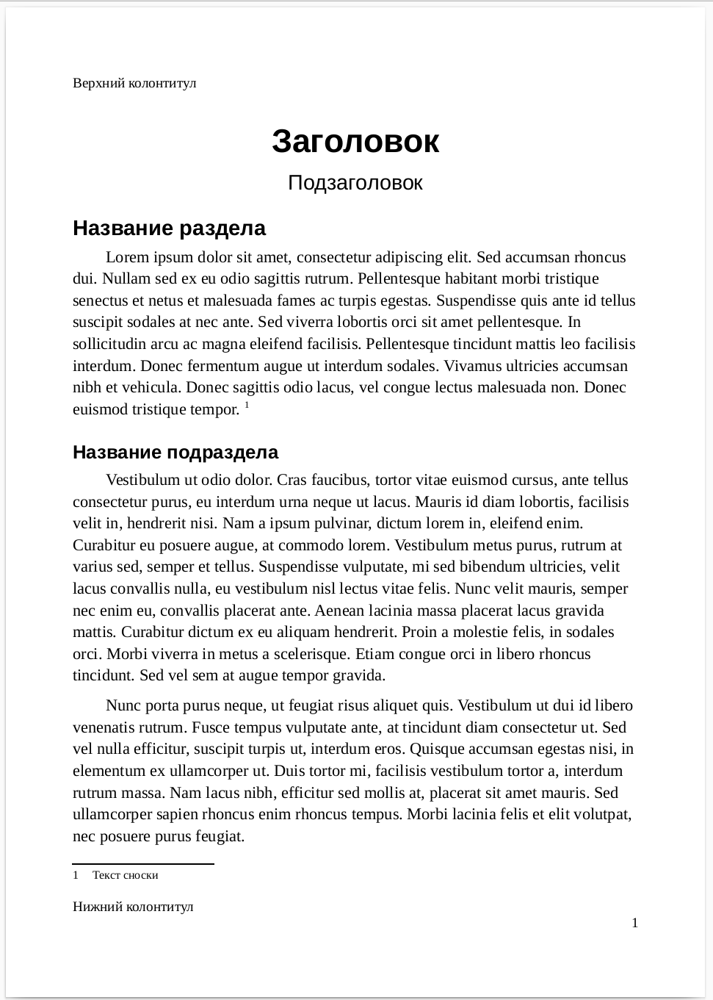
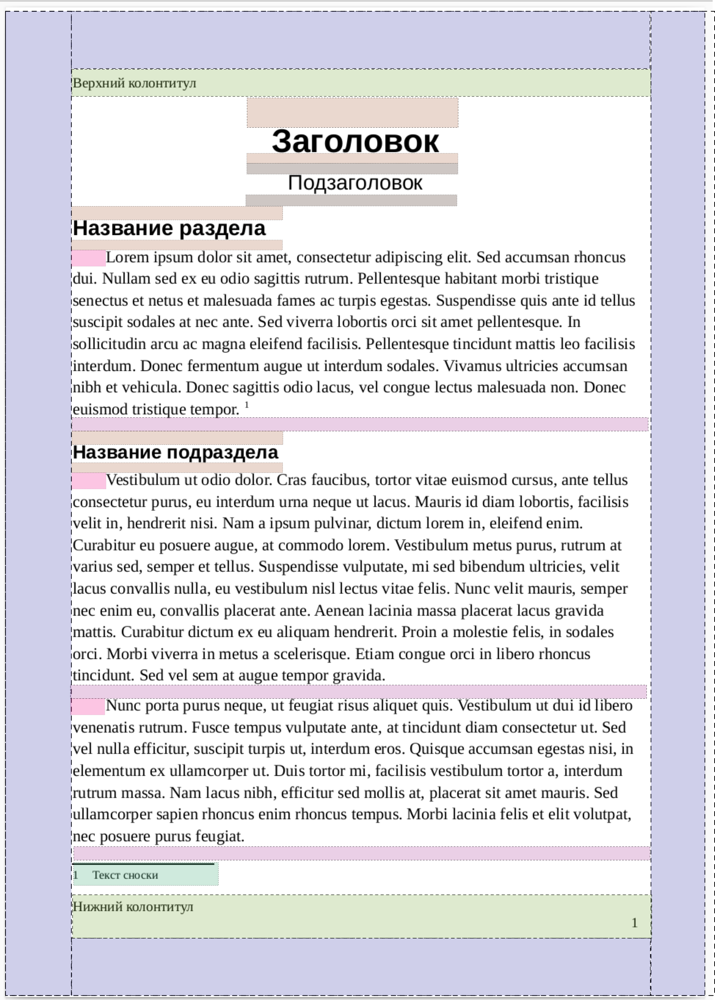
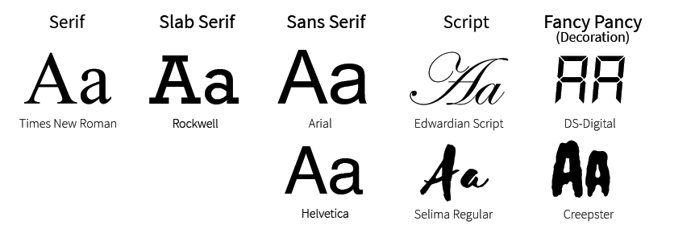

# 18 января 2022

## Создание текстовых документов

Создание качественых электронных текстовых документов - необходимый навык в соврменном мире, часть общей грамотности. Существует множество инструментов для создания текстовых документов, а также множество видов (*форматов*)текстовых доментов. Формат документа определяет способ хранения данных в файле. Примеры форматов текстовых документов:

* Простой текстовый файл (`.txt`). Содержит последовательность символов, представленных в некоторой *кодировке*.
* Файл MS Word (`.doc`, `.docx`)
* OpenDocument Format (`.odt`) - открытый формат документов. Испольуется в пакетах [OpenOffice](https://www.openoffice.org/ru/) и [LibreOffice](https://ru.libreoffice.org/)
* Portable Document Format (`.pdf`) - формат, созданный компанией Adobe. Используется для кросплатформенной передачи и печати документов

В скобках указаны *расширения*, соответствующие форматам. Расширение - это часть имени файла, отделенная точкой. В ОС Windows расширение файла определяет программу, в которой он открывается.

Инструменты для создания текстов делятся на два больших класса. Первый класс - *визуальные редакторы* - характеризуется свойством WYSIWYG (What You See Is What You Get, произносится '*визивиг*', что видишь, то и получишь). К таким инструментам относятся MS Word и LibreOffice. Такие инструменты легки в освоении. Они позволяют быстро создавать документы.

Другая группа инструментов предполагает создание документа в два этапа. На первом этапе на специальном *языке разметки* пишется простой текст, а на втором этапе текст преобразуется в выходной формат. Этот процесс схож с написанием программы и последующей компиляцией (или интерпретацией) кода. Такой способ создания документов менее интуитивен, но значительно расширяет возможности. Например, одна и та же исходная разметка может по-разному транслироваться в выходной формат в зависимости от параметров трансляци. Примеры языков разметки:

* [HTML](https://ru.wikipedia.org/wiki/HTML) (HyperText Markup Language) - язык разметки документов для отображения их в браузере.
* [Вики-разметка](https://ru.wikipedia.org/wiki/%D0%92%D0%B8%D0%BA%D0%B8-%D1%80%D0%B0%D0%B7%D0%BC%D0%B5%D1%82%D0%BA%D0%B0) - язык разметки wiki-документов. Простой и удобный язык разметки, который автоматически транслируется в HTML
* [Markdown](https://ru.wikipedia.org/wiki/Markdown) - облегченный вики-разметка (с его помощью создана эта страница).
* [(La)TeX](https://ru.wikipedia.org/wiki/LaTeX) - мощная система компьютерной верски, разработанная Дональдом Кнутом. LaTeX является самым удобным редактором для написания математических выражений любой сложности. Большая часть научных статей и диссертаций по математике и естественным наукам написаны с помощью этой системы.

## Работа в визуальном текстовом редакторе

Вот пример простого документа с текстом:

*Макет* этой страницы состоит из нескольких частей, некоторые из которых отмечены ниже

Навык *вертки* документов требует хорошего понимания этих частей и параметров, которые можно настраивать. Рассмотрим основные из них:

1. **Поля документа** (верхнее, нижнее, левое, правое) определяют размер пустого места по краям страницы.
2. Верхний и нижний **колонтитулы**. Текст, расположенный сверху или снизу относительно основного текста, вплотную к границам полей. Содержит дополнительную информацию (номер страницы, название раздела, имя автора и т.п.)
3. **Названия и заголовки**. Обычно документ имеет одно название (заголовок) и, возможно, подзаголовок. Если документ большой, то он может состоять из нескольких иерархически организованных частей (документ делится на *части*, часть делится на *главы*, глава делится на *секции*, секции - на *подсекции* или *параграфы* и т.д.).
4. **Абзацы**. Содержат основной текст документа.

Такие элементы, как названия и параграфы, имеют свойтва:

1. **Отступы сверху, сниху, слева, справа** - нимимальное пустое пространство перед объектом с соответствующей стороны. Абзацы дополнительно имеют настройку отступа первой строки (который может быть отрицательным, в этом случае вместо отступа будет *выступ*).
2. **Выравнимание текста**: левое (как в примере выше), правое, по центру или по шинире.
3. **Межстрочное расстояние** определяет расстояние между соседними строками в обном объекте.

Также есть множество тонких деталей и правил, которым можно следовать, чтобы получить *красивую* верстку. Хорошо сверстанный документ приятно имеет ясную структуру, определенный стиль и удобен для чтения. Существует стандарты (например, ГОСТ 5773-90) оформления текстовых документов.

## Шрифты

Каждый символ текста визуализирован с помощью определенного *шрифта*. Есть несколько классов шрифтов, некоторые из которых:

1. С засечками (serif)
2. Без засечек (sans serif)
3. Моноширинные (monospaced)
4. Рукописный (script)

Часто для заголовков используют шрифт без засечек, а для основного текста - с засечками (или наоборот). Листинги программного кода обычно показывают с помощью моноширинного шрифта.

Для каждого шрифта можно настраивать размер и цвет его отображения. Некоторые шрифты имеют несколько версий:

* обычный
* полужирный
* курсив
* полужирный курсив

Текстовые редакторы позволяют управлять межбуквенным расстоянием, подчеркивать, надчеркивать, зачеркивать текст, переводить символы в верхний и нижний индексы.

Не делайте так никогда:
1. Не регулируйте расстояние между абзацами с помощью одного или нескольких переносов строк.
2. Не регулируйте отступ первой строки абзаца с помощью нескольких пробелов. В качественном документе вообще не должны встречаться два пробела подряд.

Эти советы не являются результатом личных предпочтений автора. Настройка параметров должны выполняться сразу для целого типа объектов (например, все абзацы основного текста или все заголовки второго уровня). В этом лучае *изменить* стиль всего документа можно с помощью изменения только одного параметра. Расстановка отступов вручную делает невозможной такую работу с документом.

**Задание**. Найдите *несверстанный* текст (желательно в формате `.txt`) или выберите один из предложенных. Создайте текстовый документ в LibreOffice и сверстайте в нем этот текст. Желательно использовать все упомянутые элементы документа и настроить все упомянутые параметры. Текст должен выглядеть *красиво* и *ясно*.
