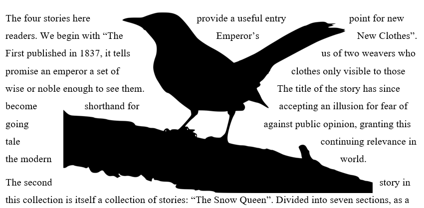

# 20 января 2022

Электронный текст может содержать различные элементы собственно текста. 

## Изображения

При вставке изображения в текст необходимо прежде всего определить *размер* изображения и его расположение относительно текста. Существует множество вариантов расположения ("обтекания" картинки текстом): по контуру, по рамке, слева, без обтекания, текст сквозь и т.д.

В научных статьях и других документах с хорошо опрееленым форматом каждое изображение должно иметь номер и подпись. Например: *"Рисунок 1. Схема экспериментальной установки"*. Подпись следует добавлять средствами текстового редактора.

## Таблицы

К таблицам применимо все что было сказано об изображениях. Помимо этого, таблицы имеют еще свои настройки: тип, толщина, цвет линий таблицы, стили заголовка и основного текста таблицы и др.

## Формулы

Смотрите описание редактора формул LibreOffice [здесь](https://wiki.nsunc.com/ooo/math)

## Оглавление, список литературы, перекрестные ссылки

Современные *визивиг* редакторы текста имеют встроенные инструменты для организации внутренней навигации по тексту. Оглавление может быть сформировано автоматически на основе структуры заголовков доумента. Можно встроить ссылку на таблицу из этого же докуменета. Номер таблицы при этом будет найдет автоматически и будет автоматически изменен, если нумерация таблиц в документе изменится.

## Стили текста

Хорошо отформатированный документ имеет ясный набор *стилей* текста, из которого он состоит: стили названия, наголовков разного уровня, основного текста и т.д. Редактирование стиля документа при этом происходит посредством изменения стилей, которые автоматическим применяются к нужным частям текста. Чем больше редактируемый текст, тем больше времени экономится при грамотной работе с ним.

**Задание 1.** Скачайте [файл](target.pdf). Создайте в LibreOffice Writer новый текстовый документ, в котором воспроизведите в нем скачанный документ как можно точнее. Файлы с изобрежениями: [1](fig1.jpg), [2](fig2.png), [3](fig3.png), [4](fig4.png), [5](fig5.png), [6](fig6.png).

