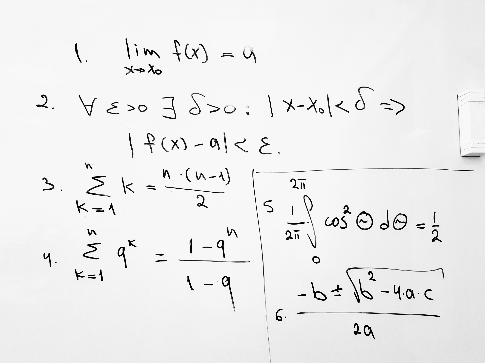

# 25 января 2022

**Задание 1.** Воспроизведите в редакторе формул LibreOffice математические выражения, показанные на рисунке (в формуле 4 - ошибка. В показателе степени должно быть `k-1` вместо `k`. Для задания это не важно, но лучше присылать верное математическое выражение. Формула 2 может быть записана в одну строку):

