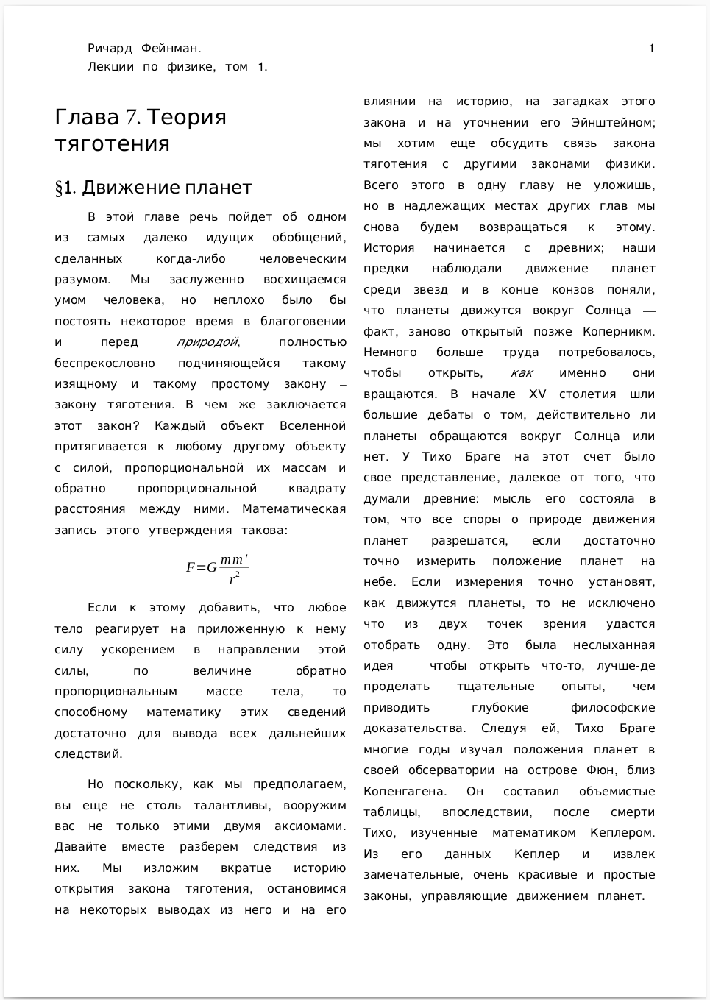
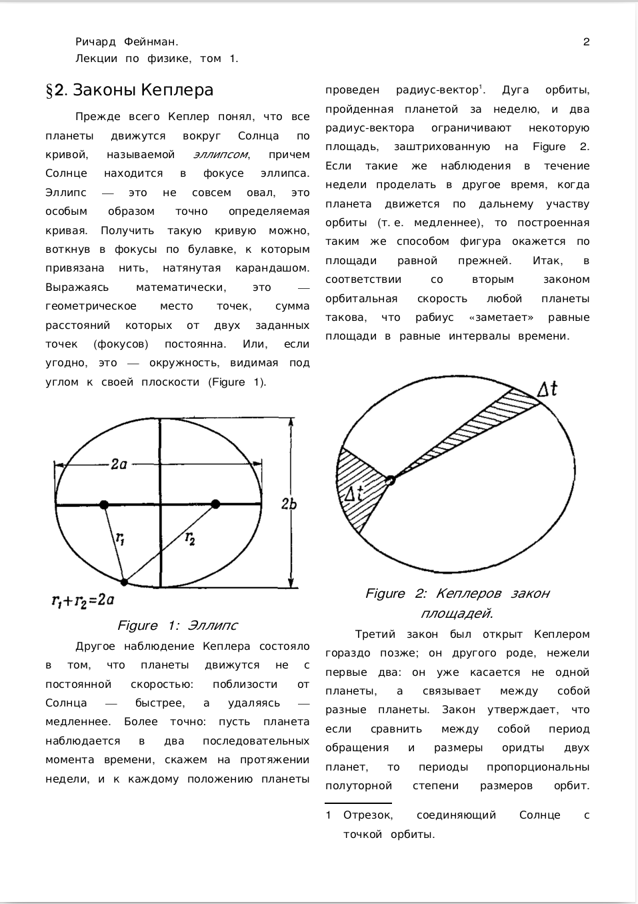
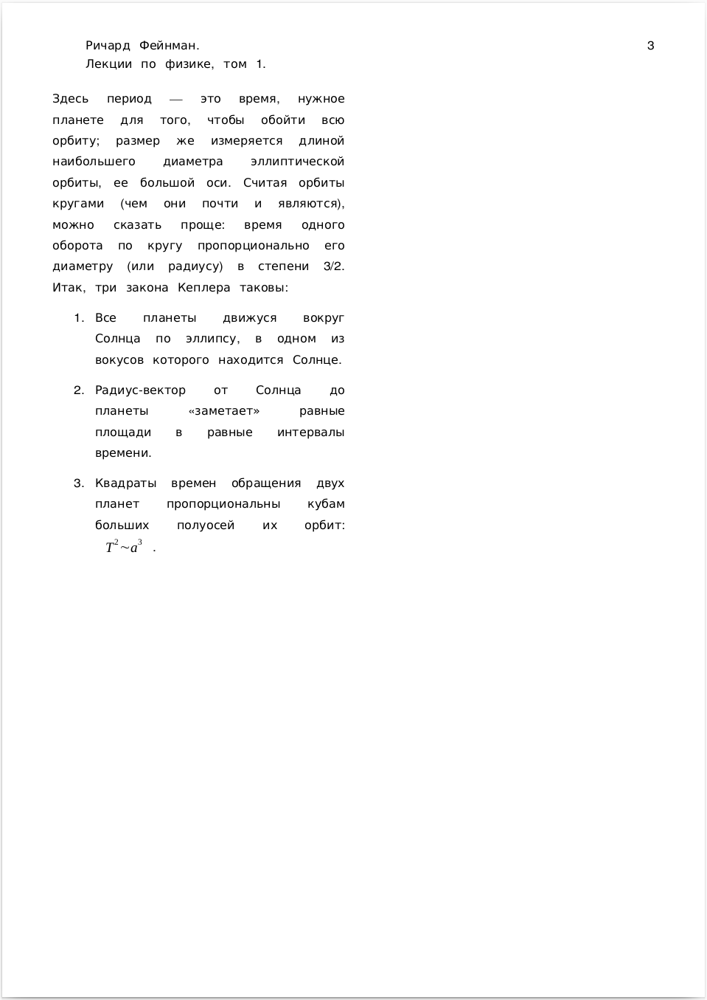

# 27 января 2022

**Задание 1.** Создайте документ в редакторе LibreOffice Writer, следуя следующей спецификации. Изображения: [1](fig1.png), [2](fig2.png).
Будем набирать первые два параграфа из седьмой главы первого тома лекций Ричарда Фенмана по физике. Параметры, не указанные в спецификации, следует оставить в значниях *по умолчанию*.

Стиль страницы:

* Формат A4
* Поле слева: 1.5 см
* Поле справа: 1.5 см
* Поле сверху: 1.0 см
* Поле снизу: 2.0 см
* Две колонки

Стили текста:

1. Основной текст:
   * Шрифт: Jamrul
   * Размер шрифта: 10 пт.
   * Выравнивание по ширине
   * Отступ первой строки абзаца: 1.0 см
   * Отступ *перед* абзацем: 0.0 см
   * Отступ *после* абзаца: 0.28 см
   * Межстрочное расстояние: коэффициент 1.15
   * Эффекты шрифта: отсутствуют
2. Заголовок первого уровня:
   * Шрифт: Pagul
   * Размер шрифта: 130%
   * Выравнивание по левому краю
   * Отступ первой строки абзаца: 0.0 см
   * Отступ *перед* абзацем: 0.42 см
   * Отступ *после* абзаца: 0.21 см
   * Межстрочное расстояние: коэффициент 1.15
   * Эффекты шрифта: отсутствуют
3. Заголовок второго уровня:
   * Шрифт: Pagul
   * Размер шрифта: 110%
   * Выравнивание по левому краю
   * Отступ первой строки абзаца: 0.0 см
   * Отступ *перед* абзацем: 0.35 см
   * Отступ *после* абзаца: 0.21 см
   * Межстрочное расстояние: коэффициент 1.15
   * Эффекты шрифта: отсутствуют
4. Верхний колонтитул:
   * две колонки
   * Шрифт: Jamrul
   * Размер шрифта: 10 пт.
   * Выравнивание по левому краю
   * Отступ первой строки абзаца: 1.0 см
   * Отступ *перед* абзацем: 0.0 см
   * Отступ *после* абзаца: 0.0 см
   * Межстрочное расстояние: коэффициент 1.0
   * Номер страницы выровнен по правому краю верхнейстроки
5. Сноски
   * Шрифт: Jamrul
   * Размер шрифта: 10 пт.
   * Выравнивание по ширине
   * Отступ первой строки абзаца: -0.6 см
   * Отступ *перед* абзацем: 0.0 см
   * Отступ *после* абзаца: 0.28 см
   * Межстрочное расстояние: коэффициент 1.15
   * Эффекты шрифта: отсутствуют
6. Подпись к рисункам
   * Шрифт: Jamrul
   * Размер шрифта: 12 пт.
   * Выравнивание по центру
   * Отступ первой строки абзаца: 0.0 см
   * Отступ *перед* абзацем: 0.20 см
   * Отступ *после* абзаца: 0.20 см
   * Межстрочное расстояние: коэффициент 1.0
   * Эффекты шрифта: курсив
7. Нумерованный список
   * Шрифт: Jamrul
   * Размер шрифта: 10 пт.
   * Выравнивание по ширине
   * Отступ абзаца слева: 1.27 см
   * Отступ первой строки абзаца: -0.64 см
   * Отступ *перед* абзацем: 0.0 см
   * Отступ *после* абзаца: 0.28 см
   * Межстрочное расстояние: коэффициент 1.15
   * Эффекты шрифта: отсутствуют

Обтекание изображений: без обтекания (изображение в отдельном абзаце, по ширине колонки текста). Ссылки на изображения должны быть выполнены в стиле "Изображение 1" или "Фигура 1". Ссылки должны быть выполнены с помощью средств редактора и быть кликабельными.

