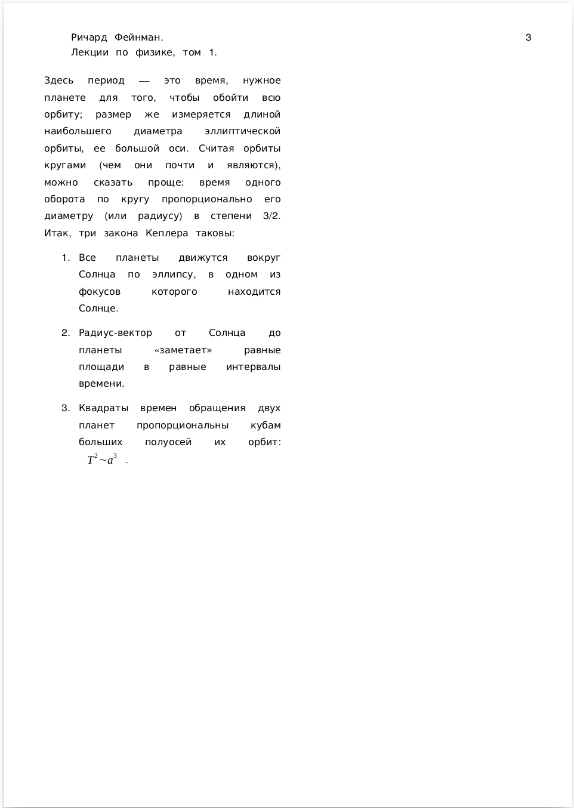

# 27 января 2022

**Задание 1.** Создайте документ в редакторе LibreOffice Writer, следуя следующей спецификации. Изображения: [1](fig1.png), [2](fig2.png).
Будем набирать первые два параграфа из седьмой главы первого тома лекций Ричарда Фенмана по физике.

Стиль страницы:

* Формат A4
* Поле слева: 1.5 см
* Поле справа: 1.5 см
* Поле сверху: 1.0 см
* Поле снизу: 2.0 см

